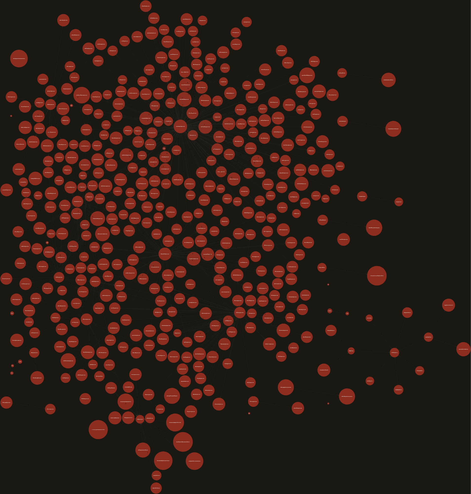

# eml-forensics

[](https://github.com/jack89-ML/eml-forensics/actions)
[](https://www.python.org/downloads/)
[](https://opensource.org/licenses/MIT)

A deterministic, offline digital-forensics and e-discovery CLI engine for `.eml` corpora (mailbox dumps, legal extractions, certified PEC mail).

Parses complex MIME structures into normalized Markdown, preserves cryptographic chains of custody with SHA-256 manifests, unwraps CAdES `.p7m` digital signatures, restores rotated scans via adaptive OCR grids, and maps communication latency and interaction networks.

---

## Subsystem Capabilities

| Command | Functionality | Target Artefacts | Dependencies |
| :--- | :--- | :--- | :--- |
| `process` | MIME parsing, body de-obfuscation, SHA-256 manifests, P7M unwrapping | `*.eml` directories, `.p7m` | Python stdlib, `openssl` (optional) |
| `ocr` | 4-way orientation grid (0°/90°/180°/270°), lexical confidence scoring | Scanned PDF, PNG, JPEG, TIFF | `[ocr]` extra (`tesseract`, `poppler`) |
| `metrics` | Conversation DAG reconstruction, per-edge delay, blackout detection | `.eml` trees, `corpus.json` | Python stdlib |
| `graph` | Relational social network analysis (From→To, From→Cc weights) | `corpus.json`, `.eml` trees | Python stdlib, Graphviz (optional) |
| `scan` | Pattern & checksum validation (CF, IBAN, Cadastre, Notary), watchlist search | Corpus bodies, `*.ocr.txt` | Python stdlib |
| `enrich` | Cross-correlate participants with official professional bar councils | Extracted identity roster | `albo-search` CLI (optional) |
| `timeline` | Chronological linear event serialization (table, CSV, JSON) | `corpus.json`, `.eml` trees | Python stdlib |

---

## Forensic & Design Principles

* **Standard Library Core**: Core ingestion, RFC 5322 parsing, network graph construction, checksum calculations, and data serialization require zero external Python packages.
* **Strict Chain of Custody**: Attachments are isolated per message, sanitized against directory traversal (`../../`), and hashed with SHA-256 for both original envelopes and unpacked payloads.
* **Deterministic Normalization**: All temporal references are converted to UTC ISO-8601 (`YYYY-MM-DDTHH:MM:SS+00:00`) regardless of source timezones or header folding.
* **Non-Destructive Read-Only Operation**: Source corpora are treated as immutable forensic evidence and opened strictly in read-only mode. All derived artefacts are contained within `--out`.
* **UNIX Pipeline Purity**: When invoking `--json` or `--csv`, `stdout` carries exclusively the raw structured payload; progress markers, warnings, and telemetry are routed strictly to `stderr`.

---

## Installation

### Core Engine (Standard Library Only)

Includes complete RFC parsing, timeline generation, metrics, relational graphs, pattern scanning, and P7M unwrapping (requires system `openssl`):

```bash
python3 -m venv .venv
source .venv/bin/activate
pip install -e .
```

### Full Forensics & OCR Suite (Optional)

Enables multi-page PDF rendering and lexical rotation-grid OCR:

```bash
pip install -e ".[ocr]"
```

System dependencies required for OCR:

```bash
# Debian/Ubuntu: sudo apt install tesseract-ocr tesseract-ocr-ita poppler-utils
# macOS:         brew install tesseract poppler
```

`emlf` is registered as a global shorthand alias for `eml-forensics`.

## Command Workflows & Usage

### 1. Ingestion, De-obfuscation & Signature Unpacking (`process`)

Scans `.eml` trees recursively, normalizes message bodies into Markdown, extracts attachments, computes cryptographic hashes, and maps transport security headers:

```bash
# Standard parsing + attachment SHA-256 chain of custody
emlf process ./evidence/raw_eml --out ./evidence/processed

# Process and automatically unwrap CAdES (.p7m) digital signatures
emlf process ./evidence/raw_eml --out ./evidence/processed --p7m
```

Artefacts emitted in `--out`:

- `messages/XXXX_Subject.md`: clean Markdown document with header metadata and sanitized text (HTML scripts, CSS, and tracking pixels removed).
- `attachments/XXXX_Subject/`: raw extracted attachments protected against path traversal.
- `attachments/XXXX_Subject/unpacked/`: extracted payload from `.p7m` envelopes accompanied by signer identity and CA certificate details.
- `corpus.json`: unified machine-readable forensic index including auth hop summaries (Received, DKIM, SPF).
- `timeline.csv`: chronologically ordered event sequence.

### 2. Lexical Orientation-Grid OCR (`ocr`)

Resolves scanned legal documents or exhibits saved upside down or rotated sideways:

```bash
# Run 4-way rotation analysis across all images and PDFs
emlf ocr ./evidence/processed/attachments --lang ita+eng

# Target a specific problematic document
emlf ocr ./evidence/scans/deed_scan.pdf --out ./evidence/ocr_transcripts
```

The engine evaluates orientations at 0°, 90°, 180°, and 270°, calculates a dictionary lexical density score, rotates the document to the optimal plane, and emits a neighboring `<filename>.ocr.txt`.

### 3. Thread DAG & Silence Detection (`metrics`)

Reconstructs conversational trees using `References`, `In-Reply-To`, and normalized subject fallbacks:

```bash
# Inspect conversational latency and default blackouts (>30 days)
emlf metrics ./evidence/processed/corpus.json

# Identify negotiation pauses exceeding 14 days and output JSON
emlf metrics ./evidence/processed/corpus.json --max-gap 14 --json | jq '.threads[] | select(.blackouts | length > 0)'
```

### 4. Relational Network Analysis (`graph`)

Maps communication flows, distinguishing direct recipients (To) from passive observers (Cc):

```bash
# Generate a Graphviz DOT representation
emlf graph ./evidence/processed/corpus.json --format dot --out network.dot

# Render to PNG for forensic reports
dot -Tpng network.dot -o network.png

# Export raw node/edge interaction matrix for Gephi / NetworkX
emlf graph ./evidence/processed/corpus.json --format json > interactions.json
```

### 5. Sensitive Data & Watchlist Scanner (`scan`)

Audits email bodies and OCR transcriptions for regulated identifiers and evidentiary keywords:

```bash
# Scan for Italian Fiscal Codes, IBANs, cadastral mappings, and notarial references
emlf scan ./evidence/processed/corpus.json

# Scan corpus using an investigative keyword watchlist
emlf scan ./evidence/processed --watchlist ./rules/keywords.txt --json
```

Built-in checksum engines mathematically validate Fiscal Codes (control character parity tables) and IBANs (ISO 7064 Mod-97-10).

### 6. Professional Register Verification (`enrich`)

Cross-references email participants against institutional registers using the `albo-search` tool:

```bash
# Verify whether participants are registered attorneys in a specific jurisdiction
emlf enrich ./evidence/processed/corpus.json --foro MILANO

# Dry-run participant extraction (identifying verified PEC addresses without queries)
emlf enrich ./evidence/processed/corpus.json --dry-run
```

## Exit Codes (POSIX Compliance)

| Exit Code | Classification | Condition |
| :--- | :--- | :--- |
| `0` | SUCCESS | Operation completed successfully; records or files produced. |
| `1` | VERIFIED_EMPTY | Search or ingestion completed cleanly, but zero target entities were found. |
| `2` | OPERATIONAL_ERROR | Missing input path, invalid parameters, missing optional extra, or system failure. |
| `130` | INTERRUPTED | Execution halted gracefully by SIGINT (Ctrl+C); no traceback printed. |

## Verification & Testing

The test suite runs fully offline without external network or binary dependencies. Synthetic fixtures are generated dynamically using RFC 2606 reserved domains:

```bash
# Run complete test suite (91 unit tests, zero-leak guard included)
python3 -m unittest discover -s tests -v

# Run the security audit guard alone
python3 -m unittest tests.test_zeroleak -v
```

## Empirical Validation & Case Studies

`eml-forensics` is benchmarked against real-world corpora:

* **Enron Email Corpus**: Processed 100 RFC 822 messages to reconstruct a 460-node relational network graph and detect multi-month communication blackouts.
* **Italian Public Administration**: Tested against CAdES `.p7m` multi-signed municipal determinations (ArubaPEC & InfoCert), successfully unwrapping CMS containers and extracting verified cadastral identifiers.

Detailed methodology, graph metrics, and reproducer commands are documented in [`docs/CASE_STUDIES.md`](docs/CASE_STUDIES.md).

<p align="center">
  
</p>

## Legal & Compliance Notice

This software is designed for legal professionals, digital forensics practitioners, and compliance auditors. It operates strictly in a local, read-only capacity over evidence corpora provided by the user. Users are responsible for ensuring that the ingestion and processing of correspondence conform to applicable privacy laws (including GDPR) and evidentiary rules of custody.

## License

Distributed under the terms of the MIT License.
